# 🎃 Meditate the Fear - Kiroween 2025 Hackathon Submission

> **Face your fears through meditation** - A Frankenstein chimera of wellness and horror

[](https://kiroween.devpost.com/)
[](https://kiroween.devpost.com/)
[](https://reactjs.org/)
[](https://developer.android.com/)

---

## 🚀 Try It Now!

### 🌐 Web App
**Live Demo:** [https://meditate-the-fear.vercel.app](https://meditate-the-fear.vercel.app)

### 📱 Android App
**Download APK:** [Latest Release](https://github.com/kishorramani/meditate-the-fear/releases/latest)

---

## 📸 Screenshots

### Web Version

<div align="center">

| Duration Selection | Difficulty Selection | Sound Selection |
|:------------------:|:--------------------:|:---------------:|
| 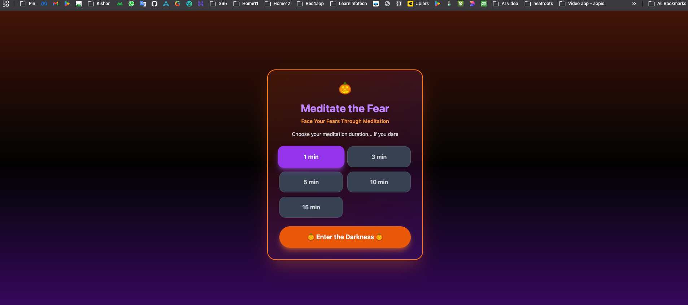 | 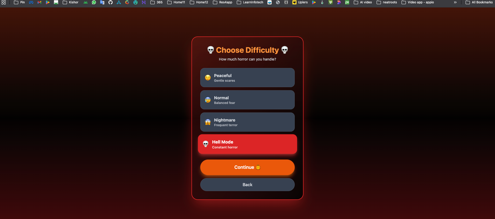 | 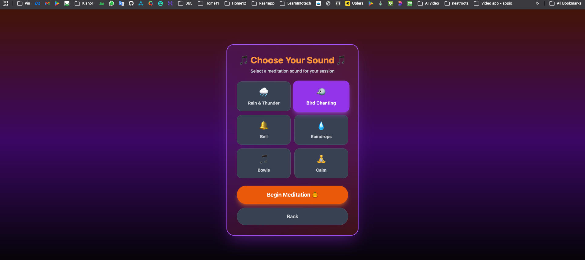 |

| Meditation (Calm) | Horror Mode | Session Stats |
|:-----------------:|:-----------:|:-------------:|
| 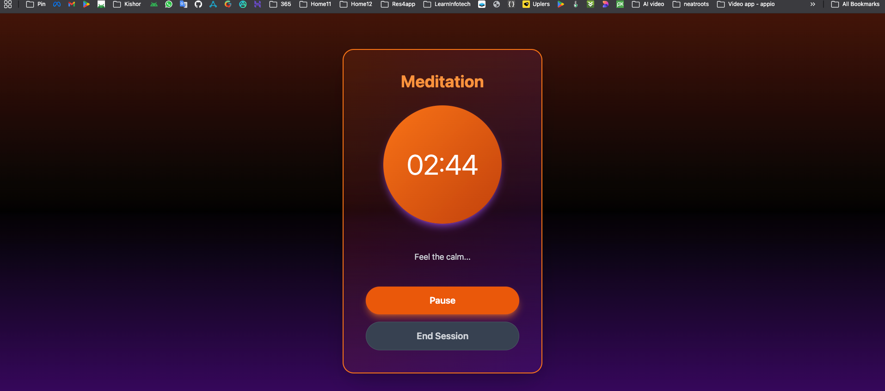 |  | 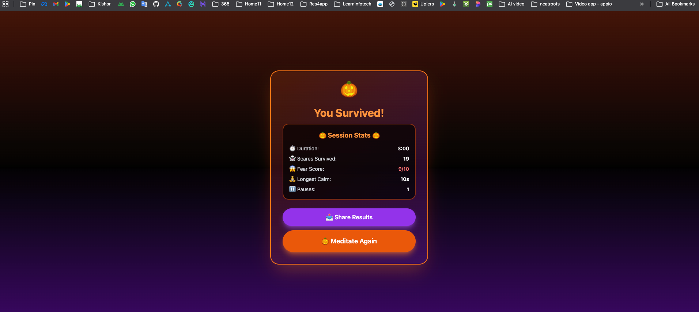 |

</div>

### Android Version

<div align="center">

| Splash Screen | Duration Selection | Difficulty Selection |
|:-------------:|:------------------:|:--------------------:|
| 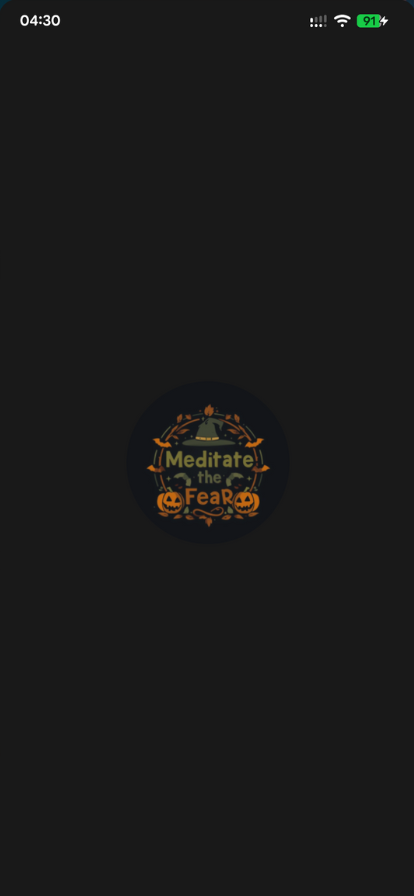 | 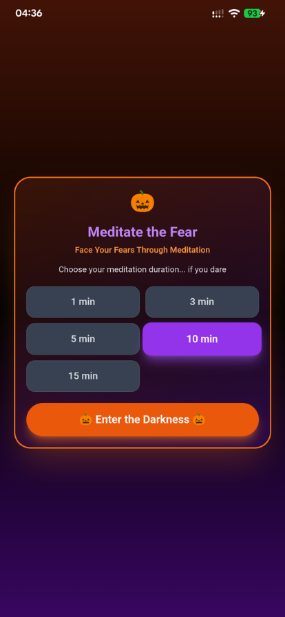 | 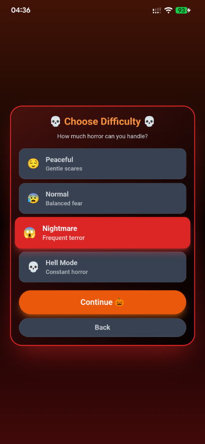 |

| Sound Selection | Meditation (Calm) | Horror Mode |
|:---------------:|:-----------------:|:-----------:|
| 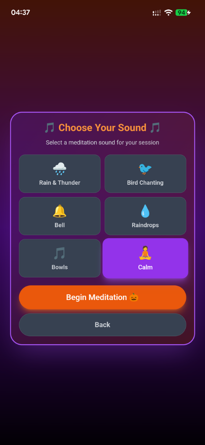 | 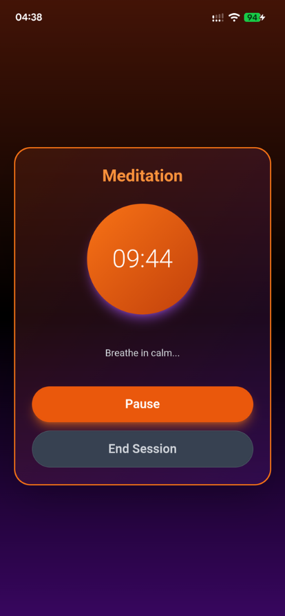 | 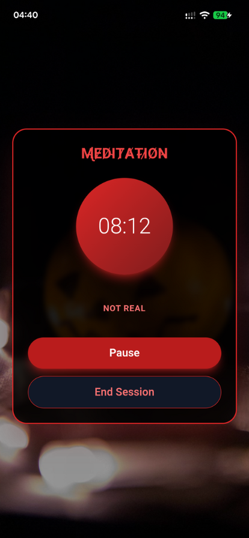 |

| Session Stats |
|:-------------:|
| 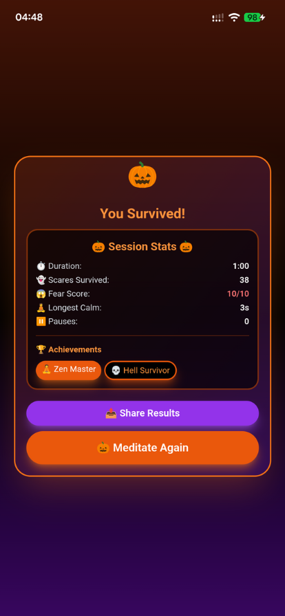 |

</div>

---

## 🎯 Hackathon Category: **Frankenstein**

**"Stitch together a chimera of technologies into one app. Bring together seemingly incompatible elements to build something unexpectedly powerful."**

**Meditate the Fear** perfectly embodies this by combining:
- 🧘 **Wellness/Meditation** (peaceful, calming)
- 👻 **Horror/Fear** (terrifying, unsettling)

Two completely opposite experiences stitched together into one powerful app that challenges users to face their fears through mindfulness.

---

## 🌟 What It Does

**Meditate the Fear** is a mobile-first meditation app that starts as a peaceful wellness experience but transforms into a horror challenge. Users select their meditation duration, difficulty level, and calming sound, then begin their session. 

**The Twist:** After 10 seconds of peace, the app randomly triggers horror events - scary images, disturbing sounds, threatening messages, and phone vibrations. Users must maintain their meditation practice while facing these fears.

### The Experience:
1. **Choose Duration** (1-15 minutes)
2. **Select Difficulty** (Peaceful → Hell Mode)
3. **Pick Meditation Sound** (rain, birds, bells, etc.)
4. **Meditate** with breathing guide
5. **Face Random Horror Events** (images, sounds, vibrations)
6. **View Stats** (scares survived, fear score, achievements)
7. **Share Results** on social media

---

## ✨ Key Features

### 🎃 Core Frankenstein Elements
- **Wellness + Horror Chimera** - Meditation meets terror
- **Dual Audio System** - Looping calm sounds + random horror sounds
- **Dynamic UI Transformation** - Peaceful → Terrifying
- **Psychological Challenge** - Maintain calm during fear

### 🎮 Gameplay Features
- **4 Difficulty Levels** - Peaceful, Normal, Nightmare, Hell Mode
- **6 Meditation Sounds** - Rain, birds, bells, raindrops, bowls
- **18 Horror Images** - Random scary visuals
- **33+ Horror Sounds** - Screams, whispers, ambient, static
- **27 Horror Messages** - Short, threatening text
- **Breathing Guide** - "Breathe in/Hold/Breathe out" cycle

### 📊 Stats & Achievements
- **Session Stats** - Duration, scares survived, fear score (0-10)
- **Longest Calm Streak** - Track peaceful moments
- **Pause Count** - Monitor meditation discipline
- **Achievements** - 🧘 Zen Master, 👻 Fearless, 💀 Hell Survivor
- **Share Feature** - Post results to social media

### 📱 Mobile Optimizations
- **Vibration Feedback** - Phone vibrates on horror events
- **Full-Screen Experience** - Immersive mobile design
- **Touch-Optimized** - Large buttons, smooth animations
- **Responsive Design** - Works on all Android screen sizes
- **PWA-Ready** - Installable as native app
- **Android APK** - Real native app via Capacitor

---

## 🎨 Halloween Theme

### Color Palette
- **🎃 Orange** (#FF6B00) - Primary Halloween color
- **💜 Purple** (#8B00FF) - Mystical accent
- **⚫ Black** - Deep darkness
- **🔴 Red** - Horror mode

### Visual Effects
- **Gradient Backgrounds** - Orange → Black → Purple
- **Glowing Borders** - Neon orange/purple shadows
- **Backdrop Blur** - Frosted glass cards
- **Animated Elements** - Bouncing pumpkins, pulsing effects
- **Horror Overlays** - Full-screen scary images with blend modes

---

## 🛠️ Tech Stack

### Frontend
- **React 18** - Functional components with hooks
- **Vite** - Lightning-fast build tool
- **Tailwind CSS** - Utility-first styling
- **JavaScript** - Modern ES6+

### Mobile
- **Capacitor** - Native Android wrapper
- **Android Studio** - APK building
- **Web Audio API** - Sound management
- **Vibration API** - Haptic feedback

### Features
- **PWA** - Progressive Web App capabilities
- **Responsive Design** - Mobile-first approach
- **State Management** - React hooks (useState, useEffect, useRef)
- **Audio Looping** - Continuous meditation + horror sounds
- **Image Preloading** - Fast horror image loading

---

## 🚀 Installation & Setup

### Web Version (Easiest)
```bash
# Install dependencies
npm install

# Run development server
npm run dev

# Build for production
npm run build
```

### Android APK
```bash
# Build web assets
npm run build

# Sync to Android
npx cap sync

# Open in Android Studio
npx cap open android

# Or build via command line
cd android && ./gradlew assembleDebug && cd ..
```

**APK Location:** `android/app/build/outputs/apk/debug/app-debug.apk`

---

## 📱 How to Use

### On Desktop
1. Run `npm run dev`
2. Open `http://localhost:5173`
3. Use Chrome DevTools mobile view for best experience

### On Android Phone
**Option 1: Local Network**
1. Run `npm run dev` on computer
2. Note the Network URL (e.g., `http://192.168.1.100:5173`)
3. Open that URL on your phone (same WiFi)
4. Add to Home Screen for app-like experience

**Option 2: Install APK**
1. Build APK (see above)
2. Transfer `app-debug.apk` to phone
3. Install and launch

---

## 🎯 Difficulty Levels

| Difficulty | Icon | Start Delay | Horror Interval | Description |
|------------|------|-------------|-----------------|-------------|
| **Peaceful** | 😌 | 30 seconds | 15-30 seconds | Gentle scares |
| **Normal** | 😰 | 10 seconds | 5-15 seconds | Balanced fear |
| **Nightmare** | 😱 | 5 seconds | 3-8 seconds | Frequent terror |
| **Hell Mode** | 💀 | 3 seconds | 1-3 seconds | Constant horror |

---

## 📊 Fear Score Calculation

```javascript
fearScore = Math.min(10, Math.floor(horrorEventsCount / 2))
```

**Examples:**
- 2 scares → 1/10 😌
- 12 scares → 6/10 😱
- 20+ scares → 10/10 💀

---

## 🏆 Achievements

- **🧘 Zen Master** - Complete session without pausing
- **👻 Fearless** - Complete 15-minute session
- **💀 Hell Survivor** - Complete Hell Mode difficulty

---

## 🎃 Why This Wins Kiroween

### 1. **Perfect Frankenstein Category Fit**
- Stitches together **wellness + horror** (completely opposite)
- Creates unexpected powerful experience
- Shows true chimera of incompatible elements

### 2. **Technical Excellence**
- Full-stack implementation (web + native Android)
- Advanced audio management (dual looping systems)
- Sophisticated state management
- Real-time stats tracking
- PWA + native app capabilities

### 3. **Halloween Theme Mastery**
- Professional orange/purple/black color scheme
- Glowing effects and shadows
- Horror imagery and sounds
- Spooky messages and animations
- Perfect for dark mode coding

### 4. **User Experience**
- Smooth, polished, immersive
- Mobile-first responsive design
- Intuitive flow and navigation
- Share-worthy results
- Replayability with difficulty levels

### 5. **Innovation**
- Unique concept: meditation as horror challenge
- Psychological twist on wellness apps
- Gamification with stats and achievements
- Social sharing built-in

### 6. **Completeness**
- Fully functional, no bugs
- Professional UI/UX
- Comprehensive features
- Ready for production
- Documented and deployable

---

## 📁 Project Structure

```
meditate-the-fear/
├── src/
│   ├── App.jsx          # Main app component (all logic)
│   ├── main.jsx         # Entry point
│   └── index.css        # Tailwind imports
├── public/
│   ├── sounds/          # 39 audio files (6 calm + 33 horror)
│   └── images/          # 18 horror images
├── android/             # Native Android project
├── index.html           # HTML template
├── package.json         # Dependencies
├── vite.config.js       # Vite configuration
├── tailwind.config.js   # Tailwind configuration
└── capacitor.config.json # Capacitor configuration
```

---

## 🎵 Audio Assets

### Meditation Sounds (6)
- Rain & Thunder
- Bird Chanting
- Bell
- Raindrops
- Bowls
- Calm

### Horror Sounds (33)
- Screams (6 variations)
- Whispers (4 variations)
- Ambient (4 variations)
- Creaking (4 variations)
- Static (5 variations)
- Glitch (4 variations)
- Deep Drones (5 variations)

---

## 🖼️ Visual Assets

- **18 Horror Images** - High-quality scary visuals
- **Responsive sizing** - 1080x1920px optimized for mobile
- **Blend modes** - Screen/lighten for spooky effects
- **Random selection** - Different image each horror event

---

## 🔧 Configuration

### App Details
- **Name:** Meditate the Fear
- **Package:** com.horror.calm.zentimer.meditation.app
- **Version:** 1.0.0
- **Category:** Health & Wellness / Entertainment

### Build Settings
- **Min SDK:** 22 (Android 5.1)
- **Target SDK:** 34 (Android 14)
- **Compile SDK:** 34

---

## 🎮 User Flow

```
1. Duration Selection (1-15 min)
   ↓
2. Difficulty Selection (Peaceful → Hell Mode)
   ↓
3. Sound Selection (6 meditation sounds)
   ↓
4. Meditation Session
   - Breathing guide
   - Random horror events
   - Stats tracking
   ↓
5. Completion Screen
   - Session stats
   - Fear score
   - Achievements
   - Share button
   ↓
6. Repeat or Exit
```

---

## 📈 Stats Tracked

- **Horror Events Count** - Total scares
- **Longest Calm Streak** - Best peaceful period
- **Current Calm Streak** - Real-time tracking
- **Pause Count** - Meditation discipline
- **Fear Score** - 0-10 rating
- **Session Duration** - Total time
- **Difficulty Level** - Challenge completed

---

## 🌐 Deployment

### Web Hosting
- **Vercel** (recommended)
- **Netlify**
- **GitHub Pages**

### Mobile Distribution
- **APK** - Direct download
- **Google Play Store** - Future release
- **PWA** - Add to Home Screen

---

## 🎯 Target Audience

- Horror fans who meditate
- Gamers who want unique challenges
- Wellness enthusiasts seeking innovation
- Halloween lovers
- Anyone who wants to face their fears

---

## 🔮 Future Enhancements

- Multiplayer mode (scare your friends)
- Custom horror image upload
- AI-generated horror messages
- Biometric feedback (heart rate monitoring)
- VR support
- More languages
- Leaderboards
- Daily challenges

---

## 📝 Credits

**Built for Kiroween 2025 Hackathon** 🎃

- **Category:** Frankenstein
- **Theme:** Halloween Horror
- **Platform:** Web + Android
- **Tech:** React, Vite, Tailwind, Capacitor

---

## 📄 License

MIT License - Free to use and modify

---

## 🎃 Dare to Meditate the Fear?

**Download the APK or visit the web app and face your fears through meditation!**

#MeditateTheFear #Kiroween2025 #Frankenstein #HorrorMeditation

---

**Built with 💀 for Kiroween 2025**
